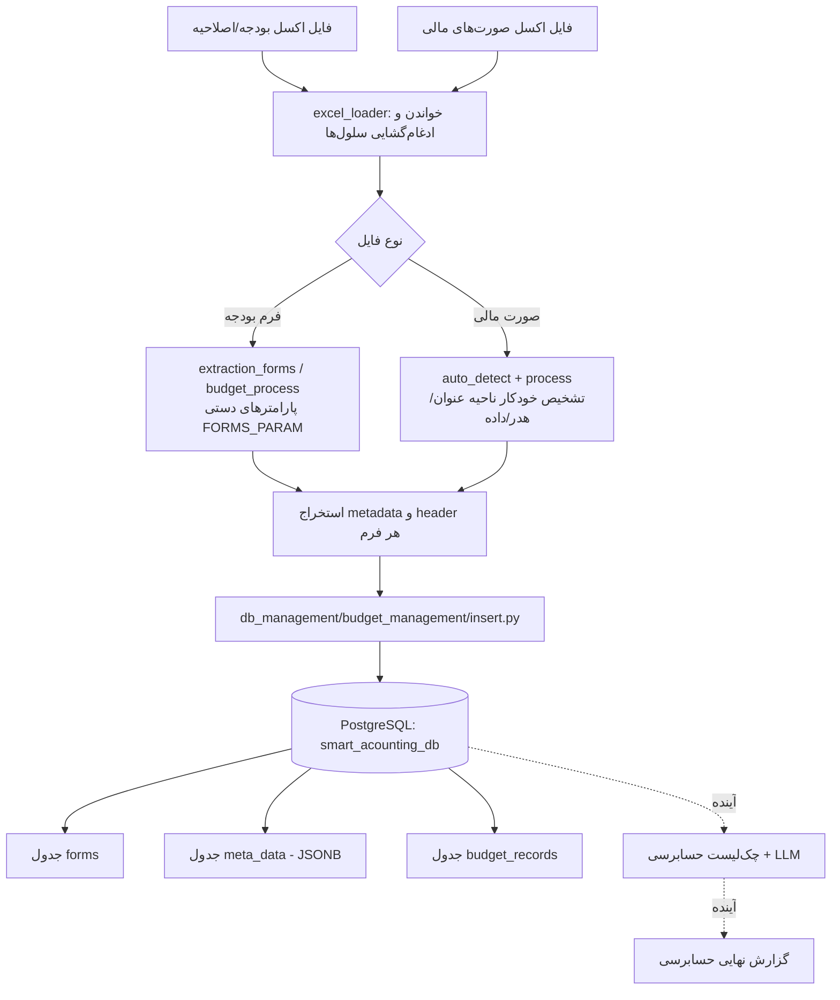

# گزارش پیشرفت پروژه — سیستم هوشمند حسابرسی و حسابداری فارسی
## (Persian Smart Accounting)

> **نکته برای نگهداری این سند:** این فایل به‌صورت زنده و تکمیل‌شونده نگه داشته می‌شود. با پایان هر هفته/اسپرینت کاری، یک بخش جدید ذیل «فصل ۴ — گزارش هفتگی پیشرفت» به همان قالب موجود (هدف هفته، دستاوردها، چالش‌ها و تصمیمات) اضافه شود. سایر فصل‌ها (معماری، ساختار پایگاه داده، وضعیت فعلی اسکریپت‌ها) نیز باید هر بار که تغییری در کد یا طرح پروژه رخ می‌دهد به‌روزرسانی شوند تا این سند همیشه بازتابی از وضعیت واقعی و آخرین پروژه باشد.

---

## فصل ۱ — معرفی و هدف پروژه

پروژه‌ی «Persian Smart Accounting» با هدف خودکارسازی و هوشمندسازی فرآیند **حسابرسی و بررسی اسناد مالی سازمان‌های دولتی/عمومی** (نمونه‌ی مورد بررسی: پارک علم و فناوری خراسان رضوی) طراحی شده است. ورودی اصلی سیستم، فایل‌های اکسل رسمی بودجه (فرم‌های تفصیلی و اصلاحیه‌ی بودجه) و صورت‌های مالی سالانه (شامل ترازنامه، صورت تغییرات وضعیت مالی، صورت مقایسه بودجه و عملکرد و یادداشت‌های توضیحی) است.

هدف نهایی پروژه، رسیدن به فرآیندی است که در آن:

1. داده‌های خام و بسیار ناهمگون اکسلی (با شیت‌بندی، ادغام سلولی و ساختار متغیر) به‌صورت خودکار **استخراج، تمیزسازی و ساختاریافته** شوند.
2. این داده‌های ساختاریافته در یک **پایگاه داده رابطه‌ای (PostgreSQL)** ذخیره شوند تا قابل پرس‌وجو، مقایسه و تحلیل باشند.
3. با استفاده از **چک‌لیست‌های حسابرسی** (که در حال حاضر به‌صورت دستی استخراج و فرمت‌بندی می‌شوند) و در آینده با کمک **مدل‌های زبانی (LLM)**، صحت‌سنجی و مقایسه‌ی خودکار میان شیت‌های مختلف انجام شود و گزارش نهایی حسابرسی نیمه‌خودکار تولید گردد.

### دامنه‌ی فعلی کار
- فاز فعلی پروژه بر روی **استخراج داده از فایل‌های اکسل بودجه و صورت‌های مالی** و **طراحی پایگاه داده** متمرکز است.
- فاز چک‌لیست حسابرسی و اتوماسیون آن با مدل‌های زبانی، در مرحله‌ی تحقیق و آماده‌سازی داده است (به فصل ۴ مراجعه کنید).

---

## فصل ۲ — ساختار مخزن پروژه

```
persian-smart-accounting/
├── db_management/
│   ├── budget_management/         # اسکریپت‌های مدیریت پایگاه‌داده مخصوص داده‌های بودجه
│   │   ├── setup.py               # ساخت دیتابیس smart_acounting_db
│   │   ├── tables.py              # ساخت جدول‌های forms / meta_data / budget_records
│   │   └── insert.py              # orchestration: استخراج + درج داده در پایگاه‌داده
│   └── test script/               # اسکریپت‌های آزمایشی اولیه (JSONB روی داده‌ی نمونه)
│       ├── setup_db.py
│       ├── insert_data.py
│       ├── query_data.py
│       └── update_delete_export.py
├── extraction_script/
│   ├── data/                      # فایل‌های اکسل خام ورودی (بودجه، اصلاحیه، صورت مالی)
│   │   ├── Budget.xlsx
│   │   ├── RevisedBudget.xlsx
│   │   ├── اصلاحیه بودجه تفصیلی 98 - 991212 (1).xlsx
│   │   ├── صورتهاي مالي 1398.xlsx
│   │   └── صورتهاي مالي 1398.md   # خروجی مارک‌داون تولید شده از فایل صورت مالی
│   └── scripts/
│       ├── docs/                  # (فعلاً خالی — محل مستندسازی فنی آینده)
│       └── xlsx/                  # هسته‌ی اصلی اسکریپت‌های استخراج
│           ├── config.py                              # پارامترهای دستی فرم‌های بودجه (FORMS_PARAM)
│           ├── excel_loader.py                         # توابع پایه: خواندن اکسل + ادغام سلول‌ها (نسخه‌ی مشترک/refactor‑شده)
│           ├── auto_detect.py                          # تشخیص خودکار نسخه ۲ (ناحیه‌ی عنوان/هدر/داده برای صورت مالی)
│           ├── process.py                              # پایپ‌لاین کامل پردازش صورت‌های مالی با تشخیص خودکار
│           ├── budget_process.py / extraction_forms.py # پایپ‌لاین پردازش فرم‌های بودجه (پارامتر-محور، دستی)
│           ├── excel_auto_extract.py                   # نسخه‌ی اولیه‌ی تشخیص خودکار (auto layout detection) برای بودجه
│           ├── extraction_multicore_with_bypass_ram.py # نسخه‌ی موازی‌سازی‌شده با ProcessPoolExecutor
│           ├── extraction_bypass_ram_save.py           # نسخه‌ی حذف I/O دیسک (بای‌پس ذخیره‌سازی موقت روی رم)
│           ├── budget.ipynb / markdownMaker.ipynb / test.ipynb  # نوت‌بوک‌های آزمایش و تولید فایل مارک‌داون
├── requirements.txt                # openpyxl, pandas, psycopg2-binary
└── LICENSE
```

> **توضیح:** در حال حاضر چند نسخه‌ی موازی از منطق مشابه (`excel_auto_extract.py`, `budget_process.py`, `extraction_forms.py`, `extraction_multicore_with_bypass_ram.py`) در مسیر `scripts/xlsx` وجود دارد که هرکدام مرحله‌ای از تکامل اسکریپت استخراج فرم‌های بودجه هستند (سریالی → موازی → بای‌پس رم → تشخیص خودکار). فایل‌های `excel_loader.py`, `auto_detect.py`, `process.py` نسخه‌ی جدیدتر و **پاک‌سازی‌شده** هستند که برای فایل صورت‌های مالی نوشته شده‌اند و منطق تشخیص خودکار عمومی‌تری دارند. یکی از اقلام بدهی فنی (technical debt) پروژه، یکپارچه‌سازی این نسخه‌ها در یک ماژول واحد است (به فصل ۵ مراجعه کنید).

---

## فصل ۳ — معماری فعلی سیستم



### ۳.۱ مراحل خط پردازش (Pipeline)

1. **بارگذاری اکسل (Excel Loading):**
   فایل با `openpyxl` بارگذاری می‌شود، سلول‌های ادغام‌شده (merged cells) شناسایی و مقدار سلول بالا-چپ آن‌ها در تمام سلول‌های زیرمجموعه پر می‌شود (`fill_merged_cells`)، سپس شیت به `pandas.DataFrame` تبدیل می‌شود.
   - برای کاهش زمان اجرا روی فایل‌های چند-شیتی بزرگ (مثل صورت مالی با بیش از ۲۰ شیت)، بارگذاری هر شیت در یک پردازش (process) مجزا از طریق `ProcessPoolExecutor` انجام می‌شود؛ اگر موازی‌سازی با خطا مواجه شود (مثلاً مشکل pickling)، به‌صورت خودکار به حالت سریالی بازمی‌گردد.

2. **تشخیص ساختار شیت:**
   - **روش دستی/پارامتریک (فرم‌های بودجه):** برای هر فرم بودجه (فرم ۱ تا ۱۰)، شماره‌ی دقیق ردیف‌های هدر، بازه‌ی ردیف‌های داده، بازه‌ی متادیتا و شماره‌ی ستون‌های سلسله‌مراتبی (hierarchy columns) به‌صورت دستی در `config.py` (دیکشنری `FORMS_PARAM`) تعریف شده است. این روش دقیق و پایدار است اما به ازای هر فرم/ساختار جدید نیاز به تنظیم دستی دارد.
   - **روش خودکار (صورت‌های مالی):** به دلیل تنوع بالای شیت‌های صورت مالی (حدود ۲۵ شیت با ساختارهای متفاوت)، الگوریتم `auto_detect.py` نوشته شد که هر ردیف را به یکی از ۴ دسته «داده / هدر / توضیح تک‌جمله‌ای / خالی» طبقه‌بندی می‌کند (بر اساس نوع مقدار سلول‌ها و بزرگی اعداد) و از آن، ناحیه‌ی عنوان، هدر و داده را استخراج می‌کند. برای شیت‌های خاص که این تشخیص شکست می‌خورد (مثل شیت «ت» با دو بلوک دارایی/بدهی کنار هم، یا شیت «يادداشتها» با چندین یادداشت شماره‌دار پشت سر هم)، override دستی یا پردازش تخصصی (`process_balance_sheet`, `process_notes_sheet`) نوشته شده است.

3. **بازسازی هدر و متادیتا:**
   - `reconstruct_headers` چند ردیفی که هدر ستون‌ها را تشکیل می‌دهند به یک رشته‌ی واحد (با جداکننده‌ی `" _ "`) ترکیب می‌کند.
   - `header_fill` با استفاده از عبارات باقاعده (regex) روی متن‌های خام بالای هر فرم، مقادیر ساختاریافته مثل `org_name`، `device_id`، `budget_year`، `form_number` و `form_title` را استخراج می‌کند.
   - `form_metadata` مجموعه‌ای از سلول‌های متنی توضیحی (پانویس‌های فرم) را جمع‌آوری می‌کند.

4. **ساخت ایندکس سلسله‌مراتبی:**
   ستون‌های شرح/عنوان ردیف (که می‌توانند بیش از یک ستون باشند، مثلاً «فصل»، «برنامه»، «ردیف») به یک ایندکس متنی ترکیبی تبدیل می‌شوند تا هر ردیف داده در نهایت به‌صورت `(item, column_name) -> value` قابل ذخیره باشد.

5. **درج در پایگاه داده:**
   `db_management/budget_management/insert.py` خروجی پایپ‌لاین استخراج (دیکشنری `{data, metadata, header}` به ازای هر فرم) را می‌گیرد و در جدول‌های `forms`, `meta_data`, `budget_records` درج می‌کند (به فصل ۳.۲ مراجعه کنید).

### ۳.۲ ساختار پایگاه داده (PostgreSQL)

پایگاه‌داده: `smart_acounting_db` (کاربر پیش‌فرض postgres، روی PostgreSQL محلی).

| جدول | توضیح |
|---|---|
| `forms` | یک ردیف برای هر فرم/سند مشخص‌شده با `form_id` (ترکیبی از شماره فرم + سال بودجه + کد دستگاه). شامل `org_name`, `device_id`, `budget_year`, `form_name`, `form_title`. |
| `meta_data` | متادیتای توضیحی هر فرم به‌صورت آرایه‌ی JSONB (ستون `attributes`)، با ارجاع به `forms.form_id`. دارای محدودیت یکتایی روی `form_id` (upsert). |
| `budget_records` | رکوردهای مقداردهی‌شده‌ی سطر × ستون هر فرم؛ هر رکورد شامل `item` (شرح ردیف)، `column_name` (نام ستون بازسازی‌شده)، `numeric_value` یا `descriptive_value`، پرچم `is_numeric` و `budget_type` (`تفصیلی` یا `اصلاحیه`). محدودیت یکتایی روی `(form_id, budget_type, item, column_name)` برای پشتیبانی از upsert و جلوگیری از رکورد تکراری. |
| `embeddings` *(کامنت‌شده — برنامه‌ریزی‌شده)* | برای ذخیره‌ی بردارهای embedding جهت جستجوی معنایی/تطبیق چک‌لیست در آینده؛ نیازمند فعال‌سازی extension `vector` (pgvector) که هنوز نصب/فعال نشده است. |

اکستنشن‌های فعال‌شده: `uuid-ossp`, `ltree` (برای ساختار سلسله‌مراتبی احتمالی آینده).

**طراحی کلیدی:** به‌جای ذخیره‌ی هر ستون اکسل به‌عنوان یک ستون پایگاه‌داده (که با توجه به تنوع بالای ستون‌ها بین فرم‌های مختلف غیرعملی بود)، داده‌ها به‌صورت long-format (هر سلول = یک رکورد با `item` و `column_name`) ذخیره می‌شوند. این تصمیم دقیقاً برای حل چالش «وجود ویژگی‌های زیاد برای هر شیت» گرفته شد (نگاه کنید به هفته ۱۱).

---

## فصل ۴ — گزارش هفتگی پیشرفت

> فرمت هر ورودی: **دوره زمانی**، **هدف/کارهای انجام‌شده**، **دستاوردهای فنی مهم**، **چالش‌ها و تصمیمات**. ورودی‌های جدید را در انتهای این فصل، به ترتیب زمانی، اضافه کنید.

### هفته ۹ تا ۱۰ (تخمینی بر اساس تاریخچه‌ی commitها، پیش از ۱۴۰۵/۰۴/۲۰)
- راه‌اندازی اولیه‌ی مخزن، افزودن `requirements.txt` (`openpyxl`, `pandas`, `psycopg2-binary`).
- تست اولیه‌ی PostgreSQL با یک جدول ساده (`products`) و فیلد JSONB برای آشنایی با ذخیره‌سازی داده‌ی نیمه‌ساختاریافته (`db_management/test script`).
- نگارش نخستین نسخه‌ی اسکریپت استخراج برای فایل بودجه (`excel_auto_extract.py` / نسخه‌ی سریالی اولیه) و تعریف دستی پارامترهای فرم‌های ۱ تا ۱۰ در `config.py`.

### هفته ۱۱ — بازه‌ی ۱۴۰۵/۰۴/۲۰ تا ۱۴۰۵/۰۴/۲۳

**کارهای انجام‌شده:**
- پیاده‌سازی اسکریپت مخصوص فایل‌های بودجه (فرم‌های ۱ تا ۱۰) و طراحی/ذخیره‌سازی اطلاعات استخراج‌شده در پایگاه‌داده PostgreSQL (جدول‌های `forms`, `meta_data`, `budget_records`).
- استفاده از اجرای موازی (`ProcessPoolExecutor`) برای کاهش زمانِ بارگذاری شیت‌های اکسل (`extraction_multicore_with_bypass_ram.py`).
- «وکتور سازی چک‌لیست» — آماده‌سازی اولیه برای بازنمایی برداری (embedding) پرسش‌های چک‌لیست حسابرسی (پیش‌نیاز مقایسه‌ی معنایی در فازهای بعدی؛ به همین دلیل اکستنشن `vector`/جدول `embeddings` در طرح پایگاه‌داده پیش‌بینی شده است، هرچند فعلاً غیرفعال است).

**چالش‌ها و راه‌حل‌ها:**
- محدودیت دستی (manual constraint) برای اسکریپت فایل بودجه: به دلیل تنوع فرم‌ها، ردیف‌های هدر/داده/متادیتا و ستون‌های سلسله‌مراتبی هر فرم باید به‌صورت دستی در `config.py` مشخص شوند؛ این اسکریپت (برخلاف نسخه‌ی صورت مالی) قابلیت تشخیص خودکار کامل ندارد.
- وجود ویژگی‌های (ستون‌های) زیاد و متغیر برای هر شیت → راه‌حل: استفاده از **ایندکس ستونی (column index)** در پایگاه‌داده به‌جای مدل‌سازی هر ستون اکسل به‌عنوان یک ستون پایگاه‌داده؛ داده‌ها به‌صورت long-format `(item, column_name, value)` ذخیره شدند (جدول `budget_records`).

### هفته ۱۲ — بازه‌ی ۱۴۰۵/۰۴/۲۷ تا ۱۴۰۵/۰۵/۰۳

**کارهای انجام‌شده:**
- طراحی اسکریپت جدید و مستقل برای پردازش فایل صورت‌های مالی (شروع مسیر `excel_loader.py`, `auto_detect.py`, `process.py`).
- پیاده‌سازی تکنیک جدید برای **تشخیص خودکار جداول** و شکستن هر شیت به جداول/بلوک‌های جداگانه (نسخه‌ی ۲ الگوریتم تشخیص در `auto_detect.py`؛ طبقه‌بندی سطر به داده/هدر/توضیح/خالی + پردازش تخصصی برای شیت‌های دو-بلوکی مثل ترازنامه («ت») و شیت‌های چند-یادداشتی مثل «يادداشتها»).

**چالش‌ها و تصمیمات:**
- فایل صورت‌های مالی (حسابرسی) از نظر ساختار کاملاً متفاوت از فایل بودجه بود (تعداد شیت بیشتر، بدون الگوی ثابت هدر/داده)؛ به همین دلیل استفاده از همان `config.py` پارامتریک فایل بودجه ممکن نبود و اسکریپت مجزا طراحی شد.
- بررسی و تست چند تکنیک برای استفاده از **مدل‌های یادگیری‌ماشین لوکال** جهت تشخیص خودکار مرزبندی جدول‌ها و درک ساختار آن‌ها — **موفقیت‌آمیز نبود**.
- تست چند مدل زبانی لوکال برای «درک» محتوای فایل‌های بودجه و صورت مالی — **با شکست مواجه شد** (نتیجه: در این فاز، تشخیص ساختار همچنان بر پایه‌ی الگوریتم‌های دستی/قاعده‌محور (rule-based) باقی ماند، نه مدل‌های یادگیری‌ماشین).

### هفته ۱۳ — بازه‌ی ۱۴۰۵/۰۵/۱۰ تا ۱۴۰۵/۰۵/۱۶
*(داده‌ای برای این بازه ثبت نشده است — در صورت وجود فعالیت، این بخش را تکمیل کنید.)*

### هفته ۱۴ — بازه‌ی ۱۴۰۵/۰۵/۱۷ تا ۱۴۰۵/۰۵/۲۳

**کارهای انجام‌شده:**
- استخراج دستی سؤالات چک‌لیست حسابرسی و تبدیل آن‌ها به فرمتی قابل درک برای آموزش مدل هوش‌مصنوعی / پردازش اسکریپتی (آماده‌سازی داده برای فازهای آینده‌ی خودکارسازی).
- تلاش (ناموفق) برای استفاده از مدل‌های زبانی محلی (Local LLM) جهت اجرای خودکار رویه‌ی پاسخ‌گویی به چک‌لیست.
- درک مبانی پایه‌ی حسابرسی و یادگیری نحوه‌ی مقایسه‌ی داده‌های مختلف میان شیت‌های متفاوت (پیش‌نیاز درست تعریف قواعد مقایسه در چک‌لیست).

**چالش‌ها:**
- عدم دسترسی به متخصص/دانش تخصصی حسابرسی برای راستی‌آزمایی روش استخراج و تفسیر سؤالات چک‌لیست.
- استفاده از مدل‌های زبانی گوناگون (احتمالاً سرویس‌های ابری/API) برای رسیدن به پاسخ‌های تاحدی دقیق؛ اما مدل‌های زبانی **محلی** برای خودکارسازی کامل مراحل استخراج پاسخ، ضعیف عمل کردند.
- نیاز به اسناد و منابع تکمیلی که هنوز در دسترس نیستند و برای ادامه‌ی کار ضروری‌اند:
  - فایل ابلاغ قانون بودجه توسط سازمان برنامه و بودجه.
  - فایل تاییدیه‌ی خزانه.
  - فایل ترازنامه‌ی کل.
  - نمونه‌ای از گزارش کمیسیون به هیأت امنا.

---

## فصل ۵ — وضعیت باز (Backlog) و بدهی‌های فنی شناخته‌شده

این فصل خلاصه‌ای از موارد باز است که در طول هفته‌های کاری شناسایی شده و باید در برنامه‌ریزی آینده لحاظ شوند:

1. **یکپارچه‌سازی اسکریپت‌های استخراج بودجه:** در حال حاضر چند نسخه‌ی مشابه/تکرارشونده از منطق استخراج فرم بودجه در پروژه وجود دارد (`excel_auto_extract.py`, `budget_process.py`, `extraction_forms.py`, `extraction_multicore_with_bypass_ram.py`, `extraction_bypass_ram_save.py`). باید در یک ماژول مشترک واحد (شبیه الگوی `excel_loader.py` + `auto_detect.py` + `process.py` برای صورت مالی) بازسازی شوند.
2. **جدول/قابلیت embeddings چک‌لیست:** جدول `embeddings` و اکستنشن `vector` (pgvector) در طرح پایگاه‌داده پیش‌بینی شده اما فعلاً کامنت شده و فعال نیست؛ باید در فاز بعدی (وکتورسازی چک‌لیست) فعال و تکمیل شود.
3. **خودکارسازی پاسخ‌گویی به چک‌لیست حسابرسی با LLM:** تلاش‌های اولیه (هفته ۱۴) با مدل‌های زبانی محلی ناموفق بوده؛ نیاز به بررسی گزینه‌های جایگزین (مدل‌های ابری، fine-tuning، یا رویکردهای retrieval-augmented) دارد.
4. **اسناد/منابع مورد نیاز که هنوز تهیه نشده‌اند** (فهرست کامل در هفته ۱۴ فوق):
   - فایل ابلاغ قانون بودجه (سازمان برنامه و بودجه)
   - فایل تاییدیه‌ی خزانه
   - فایل ترازنامه‌ی کل
   - نمونه‌ی گزارش کمیسیون به هیأت امنا
5. **مستندسازی فنی داخلی:** پوشه‌ی `extraction_script/scripts/docs` در حال حاضر خالی است و باید با مستندات فنی هر ماژول (docstring‌های تکمیلی، نمونه‌ی ورودی/خروجی هر تابع) پر شود.
6. **پوشش تست خودکار:** در حال حاضر پروژه فاقد تست‌های واحد (unit test) مشخص برای اعتبارسنجی خروجی پایپ‌لاین‌های استخراج است؛ افزودن آن‌ها ریسک رگرسیون هنگام تغییر منطق تشخیص خودکار را کاهش می‌دهد.

---

## فصل ۶ — پیوست: اطلاعات فنی مرجع

### وابستگی‌های پروژه (`requirements.txt`)
```
openpyxl
pandas
psycopg2-binary
```

### اتصال پایگاه‌داده (تنظیمات فعلی توسعه — محلی)
- نام پایگاه‌داده: `smart_acounting_db`
- میزبان: `localhost:5432`
- کاربر: `postgres`

> ⚠️ در حال حاضر رمز عبور پایگاه‌داده به‌صورت hard-coded در فایل‌های `setup.py`, `tables.py`, `insert.py` قرار دارد. برای استقرار (deployment) نهایی، این مقدار باید به متغیر محیطی (environment variable) یا فایل تنظیمات جداگانه‌ی خارج از کنترل نسخه منتقل شود.

### فرم‌های بودجه‌ی پشتیبانی‌شده (`config.py`)
`فرم 1` تا `فرم 10` (شامل زیرفرم‌های `5-1a`, `5-1b`, `6a`, `6b`) با پارامترهای دستی مربوط به ردیف‌های هدر، بازه‌ی داده، بازه‌ی متادیتا و ستون‌های سلسله‌مراتبی.

### شیت‌های صورت مالی با پردازش تخصصی (`process.py`)
- `ت` (صورت وضعیت مالی/ترازنامه) → پردازش دو-بلوکی (دارایی‌ها | بدهی‌ها و ارزش خالص)
- `ع` (صورت تغییرات در وضعیت مالی)، `تفریغ` (صورت مقایسه بودجه و عملکرد) → override دستی
- `يادداشتها`, `حمایت ها`, `یادداشتها2` → پردازش چند-بلوکی بر اساس شماره‌ی یادداشت
