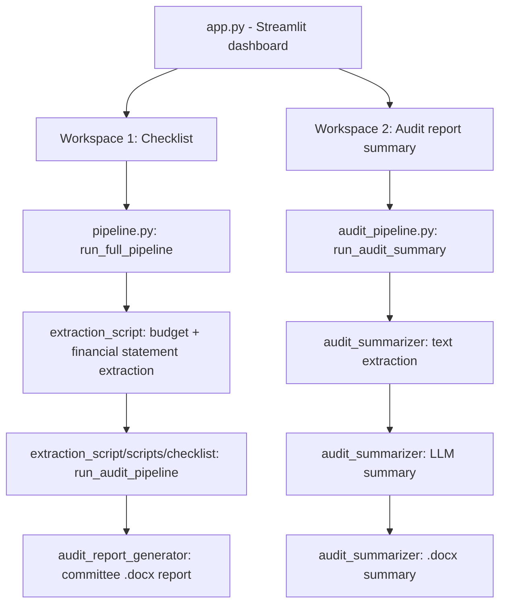

# Persian Smart Accounting (داشبورد هوشمند حسابرسی و حسابداری)

An AI-assisted toolkit for auditing and analyzing the financial documents of
Iranian public/governmental organizations — built and validated against the
real budget forms, financial statements, and audit reports of **Khorasan
Science & Technology Park** (پارک علم و فناوری خراسان).

The project turns a folder of messy, inconsistently-formatted Excel/PDF
government financial documents into structured data, runs a full **financial
audit checklist** against that data, and produces a plain-language,
committee-ready Word report — optionally enriched with an AI-generated
summary of an existing audit report.

---

## Table of Contents

1. [Overview](#overview)
2. [Architecture](#architecture)
3. [Requirements](#requirements)
4. [Installation](#installation)
5. [Configuration](#configuration)
6. [Usage](#usage)
7. [Pipeline](#pipeline)
8. [Project Components](#project-components)
9. [Data](#data)
10. [Notebooks](#notebooks)
11. [Troubleshooting](#troubleshooting)
12. [Development](#development)
13. [License](#license)

---

## Overview

**Persian Smart Accounting** automates two related but independent workflows,
both exposed through a single Streamlit dashboard (`app.py`):

1. **Financial audit checklist** — Upload the budget/financial-statement
   Excel (or PDF/legacy `.xls`) files of an organization for a given fiscal
   year. The system:
   - Extracts and structures every relevant sheet (budget forms, revised
     budget, financial statements, trial balance, credit approvals, budget
     law).
   - Runs a full audit checklist (defined in
     `extraction_script/data/Checklist_Question_extracted_handler.json`)
     against the extracted data, evaluating each question automatically where
     possible.
   - Flags every non-conforming ("FALSE") item, and optionally generates an
     AI-written **committee report** (`.docx`) summarizing them — enriched
     with the text of an existing audit report if one is uploaded.
2. **Audit report summarization** — Upload an existing audit report
   (PDF/DOC/DOCX). The system extracts its text (including OCR fallback for
   scanned PDFs) and uses an LLM to produce a plain-language, meeting-ready
   Word summary aimed at board/committee members without an accounting
   background.

**Intended users:** internal auditors, financial committees, and board
members of public-sector organizations who need to quickly verify budget
compliance and review audit findings without manually cross-referencing dozens
of spreadsheets.

## Architecture

The dashboard is a **Streamlit** application. Two independent "workspaces"
share the same UI shell but have separate processing pipelines, each running
in a background thread so the UI stays responsive:



### Project structure

```
persian-smart-accounting/
├── app.py                       # Streamlit entry point (streamlit run app.py)
├── pipeline.py                  # Checklist workspace: orchestrates extraction + audit checklist + report
├── audit_pipeline.py            # Audit-summary workspace: thin wrapper around audit_summarizer
├── icons.py                     # Inline SVG icon library used by the UI
├── styles.py                    # Custom CSS (dark theme, RTL/Persian layout)
├── requirements.txt             # All Python dependencies for the whole project
├── LICENSE                      # MIT License
├── .streamlit/config.toml       # Streamlit theme/server configuration
├── main.ipynb                   # Original prototype notebook the checklist pipeline was extracted from
├── test.ipynb                   # Scratch notebook (filtering FALSE checklist items from a JSON export)
│
├── extraction_script/           # Excel/PDF/DOC data extraction pipelines
│   ├── data/                    # Sample/reference input files and checklist definitions (see "Data")
│   └── scripts/
│       ├── xlsx/
│       │   ├── budget/          # Budget form extraction (parameter-driven + fuzzy auto-detection)
│       │   ├── financial_statements/  # Financial statement extraction (fully auto-detected layout)
│       │   └── taraz/           # Trial balance (تراز آزمایشی) loading helpers
│       ├── checklist/           # Audit checklist evaluation engine
│       └── document_conversion/ # PDF/DOC -> text/xlsx conversion utilities (incl. OCR)
│
├── audit_report_generator/      # LLM-powered "committee non-conformity report" package
├── audit_summarizer/            # Standalone LLM-powered "audit report summary" package (own CLI + tests)
├── db_management/               # Batch/offline PostgreSQL population scripts (independent of the dashboard)
└── docs/
    └── PROGRESS_REPORT.md       # Living development log (weekly progress, architecture history, backlog)
```

**Design notes:**

- `extraction_script` has no `__init__.py` files; it (and its sub-packages)
  are used as **implicit namespace packages**. Every entry point that imports
  from it (`app.py`, `pipeline.py`, `db_management/budget_management/insert.py`)
  inserts the project root onto `sys.path` first — this is intentional and
  documented in each file's header comment. Do not add `__init__.py` files to
  this tree without re-checking all the `sys.path` insertion points.
- `audit_report_generator` and `audit_summarizer` are two **independent**
  LLM-integration packages (different providers, different prompt strategies,
  different output structure) used for two different report types. They are
  not merged into one because they serve genuinely different purposes and
  `audit_summarizer` is designed to be usable completely standalone (own
  `requirements.txt`, `README.md`, CLI, and test suite).
- `audit_summarizer/file_ingest.py` and
  `extraction_script/scripts/document_conversion/file_to_text.py` are
  intentionally identical copies of the same text-extraction module — one for
  the standalone `audit_summarizer` package and one for the main dashboard's
  own PDF/DOC ingestion path. This avoids introducing a hard dependency of
  `audit_summarizer` on the rest of the repository. If you fix a bug in one,
  please mirror the fix in the other.

## Requirements

- **Python** 3.10 or newer (the codebase uses `from __future__ import
  annotations` and `X | None` union syntax throughout).
- **PostgreSQL** (only required for `db_management/` batch scripts — not
  required to run the Streamlit dashboard itself).
- **System binaries** (required for PDF/DOC processing features):
  - [Tesseract OCR](https://github.com/tesseract-ocr/tesseract) — needed for
    OCR fallback on scanned/image-only PDFs.
  - [Poppler](https://poppler.freedesktop.org/) — needed by `pdf2image` to
    rasterize PDF pages for OCR.
  - [LibreOffice](https://www.libreoffice.org/) — needed to convert legacy
    `.doc`/`.rtf`/`.odt` files to `.docx` before text extraction, and to
    convert final `.docx` summaries to `.pdf`.
- No GPU/CUDA is required; all AI features call a remote LLM API over HTTPS.

## Installation

```bash
# 1. Create and activate a virtual environment
python -m venv .venv
# Windows:
.venv\Scripts\activate
# macOS/Linux:
source .venv/bin/activate

# 2. Install Python dependencies
pip install -r requirements.txt

# 3. (Optional, only for OCR/legacy-doc support) install system binaries
#    Windows: install Tesseract-OCR and Poppler, then either place them on
#    PATH or point to them via environment variables (see Configuration).
#    Ubuntu/Debian:
sudo apt-get install tesseract-ocr tesseract-ocr-fas poppler-utils libreoffice
#    macOS:
brew install tesseract poppler --cask libreoffice
```

## Configuration

All secrets are read from environment variables (via `python-dotenv`, so a
`.env` file in the project root is also supported — see `.env.sample`).
**Never commit real API keys or database passwords.**

| Variable | Used by | Purpose |
|---|---|---|
| `B_AI_API_KEY` (or legacy `API_KEY_B_AI`) | `audit_summarizer` (audit report summary workspace) | API key for the `api.b.ai` OpenAI-compatible chat-completions endpoint |
| `API_KEY_OPENROUTER` | `pipeline.py` (committee report generation) | Fallback API key for the OpenRouter provider used to generate the committee report |
| `AUDIT_REPORT_LLM_API_KEY` | `pipeline.py` | Overrides `API_KEY_OPENROUTER` for the committee report LLM call |
| `AUDIT_REPORT_LLM_BASE_URL` | `pipeline.py` | LLM base URL for the committee report (default: `https://openrouter.ai/api/v1`) |
| `AUDIT_REPORT_LLM_MODEL` | `pipeline.py` | Model name for the committee report (default: `nvidia/nemotron-3-ultra-550b-a55b:free`) |
| `AUDIT_LLM_API_KEY` / `OPENAI_API_KEY` | `audit_report_generator` (as a standalone package/CLI) | API key resolution order used by `LLMConfig.resolve_api_key()` |
| `TESSERACT_CMD` | `audit_summarizer`, `extraction_script` document conversion | Explicit path to the `tesseract` binary. If unset, the code falls back to the default Windows install path if present, otherwise relies on `tesseract` being on `PATH` (the default on Linux/macOS) |

Additional configuration files:

- `.streamlit/config.toml` — Streamlit theme (dark mode) and server settings
  (e.g. `maxUploadSize`).
- `extraction_script/scripts/xlsx/budget/config.py` — manual layout
  parameters (`FORMS_PARAM`), sheet-name-to-form mapping
  (`SHEET_TO_CONFIG_MAP`), and fuzzy content-keyword mapping
  (`CONTENT_KEYWORD_MAP`) used to recognize each budget form.
- `db_management/budget_management/{setup,tables,insert}.py` — currently
  contain **hardcoded local development database credentials**
  (`smart_acounting_db` / `postgres` / a placeholder password). These scripts
  are standalone, offline batch tools independent of the Streamlit dashboard;
  if you intend to use them beyond local development, replace the hardcoded
  credentials with environment variables before doing so.

## Usage

### Run the dashboard

```bash
streamlit run app.py
```

This opens the dashboard with two switchable workspaces in the sidebar:
"چک‌لیست حسابرسی مالی" (financial audit checklist) and "خلاصه‌سازی گزارش
حسابرسی" (audit report summarization).

### Run the audit report summarizer standalone (CLI)

```bash
cd audit_summarizer
python main.py --input report.pdf --output-format docx
```

See `audit_summarizer/README.md` for the full CLI reference.

### Run the committee report generator standalone (CLI)

```bash
python -m audit_report_generator.cli \
    --checklist-json-file sample_data/checklist_false_items.json \
    --doc-text-file sample_data/audit_report.txt \
    --output output/گزارش_کمیسیون.docx
```

### Populate the PostgreSQL database from budget files (offline batch tool)

```bash
python db_management/budget_management/setup.py   # create the database
python db_management/budget_management/tables.py  # create the schema
python db_management/budget_management/insert.py  # extract + insert budget data
```

This is a separate, independent workflow from the Streamlit dashboard — it
persists extracted budget data into PostgreSQL for downstream querying, but
is not (yet) read by the dashboard itself.

## Pipeline

### Financial audit checklist workspace

```
Uploaded files (budget/revised budget/financial statements/trial balance/…)
  ↓
xls/pdf → xlsx normalization (pipeline.save_uploaded_file)
  ↓
Specialized extraction per document type
  (extraction_script.scripts.xlsx.budget.budget_process — budget forms
   extraction_script.scripts.xlsx.financial_statements.process — financial statements
   pandas.read_excel + fuzzy content matching — trial balance)
  ↓
Sheet merge into one unified in-memory dataset (IMPORTED_DF)
  ↓
Year/column relabeling (extraction_script.scripts.checklist.year_relabeler)
  ↓
Audit checklist evaluation, question by question
  (extraction_script.scripts.checklist.checklist_process.run_audit_pipeline)
  ↓
Non-conforming ("FALSE") items collected
  ↓
Committee report generation (audit_report_generator, LLM-powered, optional)
  ↓
Output: on-screen results + downloadable .docx committee report
```

### Audit report summarization workspace

```
Uploaded audit report (PDF/DOC/DOCX)
  ↓
Text extraction (PyMuPDF → pdfplumber → pypdf fallback chain, + OCR fallback for scans)
  ↓
Prompt construction (audit_summarizer.llm_client.build_summary_prompt)
  ↓
LLM call (api.b.ai OpenAI-compatible endpoint)
  ↓
Word document rendering (audit_summarizer.doc_writer, RTL/Persian formatting)
  ↓
Output: downloadable .docx meeting-ready summary
```

## Project Components

| Component | Responsibility |
|---|---|
| `app.py` | Streamlit UI: file upload widgets, progress/log rendering, results display, downloads |
| `pipeline.py` | Orchestrates the checklist workspace end-to-end; background-thread job management |
| `audit_pipeline.py` | Orchestrates the audit-summary workspace; background-thread job management |
| `icons.py` / `styles.py` | UI-only: inline SVG icons and custom dark-mode/RTL CSS |
| `extraction_script/scripts/xlsx/budget/` | Budget form extraction: parameter-driven (`config.py`) + fuzzy sheet/content matching |
| `extraction_script/scripts/xlsx/financial_statements/` | Financial statement extraction with fully automatic layout detection |
| `extraction_script/scripts/xlsx/taraz/` | Trial balance loading helper |
| `extraction_script/scripts/checklist/` | Audit checklist evaluation engine: condition parsing, formula evaluation (`math_func_to_latex_code.py`), fuzzy metadata search, year/column relabeling |
| `extraction_script/scripts/document_conversion/` | PDF → xlsx conversion for tabular Persian PDFs, and generic PDF/DOC → text extraction (with OCR fallback) |
| `audit_report_generator/` | LLM-powered generator of the "committee non-conformity report" (`.docx`), built on the `openai` client library |
| `audit_summarizer/` | Standalone LLM-powered audit-report summarizer package, with its own CLI, tests, and samples |
| `db_management/budget_management/` | Batch scripts to create the PostgreSQL schema and bulk-insert extracted budget data |

## Data

`extraction_script/data/` contains the real reference input files and
checklist definitions this project was built and validated against:

- **Budget files**: `1- ابلاغ بودجه مصوب سال 98.xlsx`, `ابلاغ.xlsx`,
  `اصلاحیه بودجه تفصیلی 98 - 991212 (1).xlsx` and its original `.pdf`,
  `افزایش سقف درآمد اختصاصی 98.{xlsx,pdf}`,
  `تاييديه اعتبارات هزينه اي...98.{xlsx,pdf}`.
- **Financial statements**: `صورتهاي مالي 1398.{xlsx,pdf}`.
- **Trial balance**: `تراز 98.{xls,xlsx}`.
- **Audit report**: `گزارش  اول پارک خراسان سال 1398.doc`,
  `گزارش_حسابرسی(1).json`.
- **Checklist definitions**:
  `Checklist_Question_extracted_examples.json`,
  `Checklist_Question_extracted_handler.json` (the one actually loaded by
  `pipeline.py` at runtime), `Checklist_Question_extracted_handler_def.json`.
- **Scratch outputs**: `check_budget.xlsx`, `check_output.xlsx`, `Report.pdf`.

This directory is treated as read-only reference/sample data by the
application; uploaded files from the dashboard are processed in a separate
temporary working directory (created by `pipeline.make_temp_workdir()` /
`audit_pipeline.make_audit_temp_workdir()`) and cleaned up after each run.

## Troubleshooting

- **`ModuleNotFoundError` when running scripts directly** — most modules rely
  on `sys.path` insertion performed at the top of the entry-point file (e.g.
  `pipeline.py`, `app.py`, `db_management/budget_management/insert.py`). Run
  scripts from the project root, or via the documented entry points, rather
  than executing a deeply nested file directly.
- **`API_KEY ... در فایل env پیدا نشد` errors** — set the corresponding
  environment variable (see [Configuration](#configuration)) or add it to a
  `.env` file in the project root.
- **OCR fails / "Tesseract is not installed" errors** — install Tesseract OCR
  and, on Windows, either let the code auto-detect the default install path
  (`C:/Program Files/Tesseract-OCR/tesseract.exe`) or set `TESSERACT_CMD`.
- **`.doc` file conversion fails** — LibreOffice must be installed and
  available on `PATH` (used via `subprocess` to convert `.doc`/`.rtf`/`.odt`
  to `.docx`).
- **PDF text comes out mirrored/reversed (Persian/Arabic)** — this is a known
  limitation of coordinate-based PDF text extractors (`pdfplumber`, `pypdf`)
  for right-to-left scripts. The code prefers PyMuPDF (correct logical
  reading order) and includes a heuristic safety net
  (`_fix_reversed_rtl_lines`) for the fallback paths; if a specific PDF still
  comes out reversed, it likely needs `pymupdf` installed (it is optional at
  import time).
- **`psycopg2` connection errors in `db_management/`** — these scripts assume
  a local PostgreSQL instance with the hardcoded credentials in
  `budget_management/{setup,tables,insert}.py`; update those values (or
  migrate them to environment variables) to match your database.

## Development

- **Add a new budget form type**: extend `FORMS_PARAM` and
  `SHEET_TO_CONFIG_MAP` in `extraction_script/scripts/xlsx/budget/config.py`.
- **Add a new checklist question**: add it to
  `extraction_script/data/Checklist_Question_extracted_handler.json`,
  following the existing `evaluation_logic` schema documented in
  `extraction_script/scripts/checklist/checklist_process.md`.
- **Add a new file type/upload slot** to the checklist workspace: extend
  `FILE_SLOTS` in `pipeline.py` and wire it into
  `pipeline.build_imported_sheets`.
- **Modify LLM behavior**: `audit_summarizer/llm_client.py` (audit summary
  prompt) and `audit_report_generator/prompt_builder.py` (committee report
  prompt) are the two prompt-construction entry points.
- **Run tests**:
  ```bash
  cd audit_summarizer
  pytest -q
  ```
  (there is currently no automated test suite for the extraction/checklist
  pipelines themselves — see `docs/PROGRESS_REPORT.md` for known backlog
  items, including this one).
- **Extend the pipeline**: both `pipeline.run_full_pipeline` and
  `audit_pipeline.run_audit_summary` are plain functions designed to be called
  directly (outside of Streamlit) for scripting/testing purposes; the
  `job` dict parameter is optional and only needed for live progress
  reporting in the dashboard.

## License

MIT License — see [`LICENSE`](LICENSE) for the full text.
