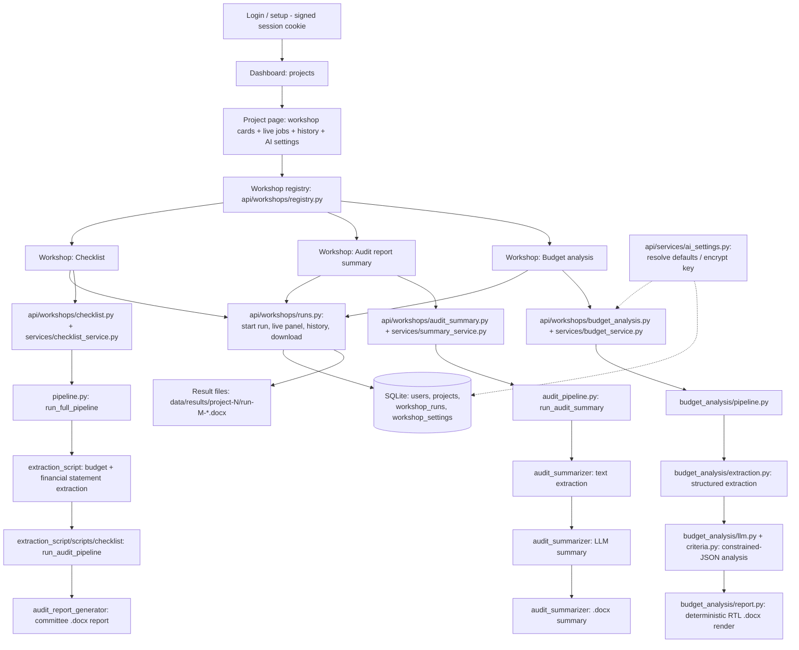

# Persian Smart Accounting (داشبورد هوشمند حسابرسی و حسابداری)

An AI-assisted toolkit for auditing and analyzing the financial documents of
Iranian public/governmental organizations — built and validated against the
real budget forms, financial statements, and audit reports of **Khorasan
Science & Technology Park** (پارک علم و فناوری خراسان).

The project turns a folder of messy, inconsistently-formatted Excel/PDF
government financial documents into structured data, runs a full **financial
audit checklist** against that data, and produces a plain-language,
committee-ready Word report — optionally enriched with an AI-generated
summary of an existing audit report.

---

## Table of Contents

1. [Overview](#overview)
2. [Architecture](#architecture)
3. [Requirements](#requirements)
4. [Installation](#installation)
5. [Configuration](#configuration)
6. [Usage](#usage)
7. [Pipeline](#pipeline)
8. [AI settings](#ai-settings)
9. [Project Components](#project-components)
10. [Data](#data)
11. [Notebooks](#notebooks)
12. [Testing](#testing)
13. [Troubleshooting](#troubleshooting)
14. [Development](#development)
15. [License](#license)

---

## Overview

**Persian Smart Accounting** automates three related but independent workflows,
all exposed through a **FastAPI + server-rendered HTML/Tailwind** web dashboard
(`api/` + `web/`). The UI was originally built with Streamlit; that version is
preserved for reference under [`legacy_streamlit/`](#project-structure) but is no
longer the primary interface — see [Architecture](#architecture).

The dashboard is **login- and project-based**: after signing in, a user creates
projects (one per organization / fiscal period), and runs any registered
**workshop** inside a project. Several workshops can run **concurrently** in the
same project without their state colliding, and every finished run is kept in
that project's **history** (result file + run metadata only — uploaded inputs are
still deleted after each run). Deleting a project removes all of its data
(database rows *and* result files).

1. **Financial audit checklist** — Upload the budget/financial-statement
   Excel (or PDF/legacy `.xls`) files of an organization for a given fiscal
   year. The system:
   - Extracts and structures every relevant sheet (budget forms, revised
     budget, financial statements, trial balance, credit approvals, budget
     law).
   - Runs a full audit checklist (defined in
     `extraction_script/data/Checklist_Question_extracted_handler.json`)
     against the extracted data, evaluating each question automatically where
     possible.
   - Flags every non-conforming ("FALSE") item, and optionally generates an
     AI-written **committee report** (`.docx`) summarizing them — enriched
     with the text of an existing audit report if one is uploaded.
2. **Audit report summarization** — Upload an existing audit report
   (PDF/DOC/DOCX). The system extracts its text (including OCR fallback for
   scanned PDFs) and uses an LLM to produce a plain-language, meeting-ready
   Word summary aimed at board/committee members without an accounting
   background.
3. **Budget analysis** — Upload the detailed budget amendment of a **base year**
   and of the **year under review** (Excel, or a PDF printed from Excel). The
   system extracts the forms/rows/values structurally, evaluates a configurable
   set of monitoring criteria (salary growth, performance ceiling, technology
   support, headcount structure, carry-over balances, organizational
   stability, …), and produces a single integrated management **budget
   monitoring report** (`.docx`): deviation matrix with the exact location of
   each deviation, significant findings, financial/structural risks, and the
   items that need a management decision or clarification. See
   [Pipeline → Budget analysis](#budget-analysis-workshop) for the three-stage
   design.

**Intended users:** internal auditors, financial committees, and board
members of public-sector organizations who need to quickly verify budget
compliance and review audit findings without manually cross-referencing dozens
of spreadsheets.

## Architecture

The dashboard is a **FastAPI** application (`api/`) with a server-rendered
**Jinja2 + Tailwind** frontend (`web/`) — no separate JS build step, no SPA
framework. Every workshop shares the same UI shell/components but has its own
processing pipeline, each running in a background thread so a page can poll job
status (`GET /api/projects/{id}/<slug>/jobs/{job_id}`) without blocking:



Each workshop is deliberately kept **thin at the API layer**: its project-scoped
router only parses the HTTP request and calls a service function; the service
validates/saves uploads and hands off to the unchanged
`pipeline.py`/`audit_pipeline.py`/`budget_analysis` background-job functions; a
single in-memory `JobManager` (`api/jobs/job_manager.py`) tracks job dicts for
every workshop — each job tagged with `(project_id, workshop_type, run_id)` — so
concurrent runs never share state. When a job reaches its final status, a
completion callback (registered via `JobManager.watch_lifecycle`) writes the run's
**result file** and its **history row** — this is why the pipeline modules need no
changes for history to work.

**Isolation guarantees.** Job state (`JobManager`) and history rows
(`workshop_runs`) are both keyed by project *and* workshop: a job or run of one
workshop is not readable through another workshop's endpoints (the lookup helpers
`api/utils/jobs.py::get_job_or_404` and
`api/workshops/runs.py::read_run_download` check both labels), and a project of
another user is invisible (404, not 403, so the existence of other users'
projects does not leak). Database access is a **per-request session**
(`api/db/base.py::get_session`); background threads that record a finished run
open their own short-lived session, so no session is shared between requests or
threads.

**Workshop registry** (`api/workshops/registry.py`): "which workshops exist" is
data, not something hardcoded in routers/templates. The dashboard's workshop
cards, the navigation links, the FastAPI route registration and the workshop page
route are all generated from `WORKSHOPS`. Adding a fourth workshop therefore means
a new module plus one registry entry — no template edits (see the
[concrete checklist](#adding-a-new-workshop)).

### Project structure

```
persian-smart-accounting/
├── api/                          # FastAPI application (uvicorn api.main:app --reload)
│   ├── main.py                   # App factory, session middleware, registry-driven router registration, error handlers
│   ├── config.py                 # Settings (pydantic-settings): LLM env vars + API/dashboard settings
│   ├── templating.py             # Shared Jinja2Templates + globals (icon()) and Persian display filters
│   ├── cli.py                    # Admin CLI: create-user / list-users
│   ├── storage.py                # Result-file storage on disk (safe path resolution + per-project cleanup)
│   ├── auth/                     # Session-cookie auth: password hashing + FastAPI dependencies
│   ├── db/                       # SQLite/SQLAlchemy: engine+session (base.py) and ORM models (models.py)
│   ├── repositories/             # All dashboard queries (users, projects, workshop_runs/settings)
│   ├── jobs/job_manager.py       # In-memory job registry, keyed by (project, workshop, run) + completion hook
│   ├── workshops/                # THE EXTENSION POINT: registry.py + one module per workshop
│   │   ├── registry.py           # WorkshopDefinition + WORKSHOPS (single source of truth)
│   │   ├── runs.py               # Run history: create row, finalize result, live jobs panel, downloads
│   │   ├── pages.py              # Shared page context (user/project/workshops) for workshop templates
│   │   ├── checklist.py          # Workshop: financial audit checklist (router + registry entry)
│   │   ├── audit_summary.py      # Workshop: audit report summarization (router + registry entry)
│   │   └── budget_analysis.py    # Workshop: budget analysis (router + registry entry)
│   ├── routers/                  # Thin HTML/JSON endpoints: auth.py, dashboard.py (projects+pages), settings.py
│   ├── services/                 # Upload validation/saving + job orchestration + project deletion
│   │   ├── checklist_service.py  # Checklist workshop adapter over pipeline.py
│   │   ├── summary_service.py    # Audit-summary workshop adapter over audit_pipeline.py
│   │   ├── budget_service.py     # Budget-analysis workshop adapter over budget_analysis/
│   │   ├── ai_settings.py        # Resolve defaults, validate, encrypt/decrypt per-workshop API keys
│   │   └── project_service.py    # Full project deletion (jobs + rows + files)
│   ├── schemas/                  # Pydantic response models (common.py holds the shared JobStatus type)
│   └── utils/                    # icons.py, uploads.py, jobs.py, downloads.py, formatting.py (Jalali/digits)
│
├── web/                          # Server-rendered frontend assets
│   ├── templates/                # Jinja2 templates: base.html shell, login/dashboard/project pages + workshop pages
│   │   ├── error.html            # Unexpected (500) error page
│   │   ├── error_page.html       # Expected HTTP errors (404/403/…) for page routes, in Persian
│   │   └── components/           # Reusable partials: dropzone, stepper, progress bar, toast, run_history, ai_settings
│   └── static/                   # css/app.css (fonts + small custom styles), js/*.js (page logic), fonts/
│
├── data/                         # Local dashboard data (gitignored): psa.db (SQLite) + results/project-N/*.docx
├── tests/                        # API-layer tests (FastAPI TestClient), see "Testing"
├── conftest.py                   # pytest bootstrap: puts the project root on sys.path (no pytest.ini/pyproject)
│
├── legacy_streamlit/             # Original Streamlit UI (app.py/icons.py/styles.py), reference only
├── pipeline.py                   # Checklist workshop: orchestrates extraction + audit checklist + report
├── audit_pipeline.py             # Audit-summary workshop: thin wrapper around audit_summarizer
├── budget_analysis/              # Budget-analysis workshop: 3-stage pipeline (extract → LLM JSON → docx)
├── requirements.txt              # All Python dependencies for the whole project
├── LICENSE                       # MIT License
├── main.ipynb                    # Original prototype notebook the checklist pipeline was extracted from
├── test.ipynb                    # Scratch notebook (filtering FALSE checklist items from a JSON export)
│
├── extraction_script/            # Excel/PDF/DOC data extraction pipelines
│   ├── data/                     # Sample/reference input files and checklist definitions (see "Data")
│   └── scripts/
│       ├── xlsx/
│       │   ├── budget/           # Budget form extraction (parameter-driven + fuzzy auto-detection)
│       │   ├── financial_statements/  # Financial statement extraction (fully auto-detected layout)
│       │   └── taraz/            # Trial balance (تراز آزمایشی) loading helpers
│       ├── checklist/            # Audit checklist evaluation engine
│       └── document_conversion/  # PDF/DOC -> text/xlsx conversion utilities (incl. OCR)
│
├── audit_report_generator/       # LLM-powered "committee non-conformity report" package
├── audit_summarizer/             # Standalone LLM-powered "audit report summary" package (own CLI + tests)
├── db_management/                # Batch/offline PostgreSQL population scripts (independent of the dashboard)
└── docs/
    └── PROGRESS_REPORT.md        # Living development log (weekly progress, architecture history, backlog)
```

`legacy_streamlit/` is kept **for reference only** — it is not maintained, not
reached from the FastAPI app, and not covered by the test suite. Read it when you
want to compare behaviour with the original prototype.

**Extensibility notes (read before adding a new workshop):**

- File-slot definitions have a single source of truth per workshop, and the
  upload form is rendered from it: `pipeline.py::FILE_SLOTS` for the checklist
  workshop (`api/services/checklist_service.py` validates against the same dict),
  `api/services/budget_service.py::FILE_SLOTS` for the budget workshop, and a
  small dict in `api/workshops/audit_summary.py` for the audit-summary workshop's
  single slot. The last two exist because `audit_pipeline.py` and
  `budget_analysis/` (both out of scope for the API/UI build) don't expose a
  `FILE_SLOTS`-equivalent structure; each is documented in a comment at its call
  site, and no template hardcodes a slot.
- `JobStatus` (`pending`/`running`/`done`/`error`) has a single definition in
  `api/schemas/common.py`, used by every workshop schema.
- The **workshop registry** (`api/workshops/registry.py`) is the extension point.
  Each workshop module declares a `WorkshopDefinition` (slug, Persian name and
  description, icon/accent, its project-scoped `router`, its page template and
  renderer, plus small callables: `estimate_progress`, `collect_result`,
  `has_download`, `summary_chips_fa`, and optionally `settings_applied` /
  `test_connection`) and registers it. Because the dashboard cards, the
  navigation, the FastAPI route registration and the `/projects/{id}/{slug}` page
  route all iterate the registry, adding a workshop means: one new module in
  `api/workshops/` + one import line in `api/workshops/__init__.py` (import order
  = display order). No template, navigation or router edit is needed. The full
  step-by-step version is [Adding a new workshop](#adding-a-new-workshop).
- Project-scoping contract for a workshop's own endpoints: everything lives under
  `/api/projects/{project_id}/<slug>/...`, and job state is tagged with
  `(project_id, workshop_type, run_id)`. When the job finishes, the completion
  hook (`api/workshops/runs.py::finalize_run`) stores the result file plus the
  history row. The workshop's page template must set
  `window.PSA_WORKSHOP = {apiBase, projectId, storageKey}` so its JS builds URLs
  from the registry-provided base instead of hardcoding them (see
  `web/static/js/checklist.js`).
- The reusable UI building blocks (`web/templates/components/*.html` +
  their companion `window.psaSetStep` / `psaSetProgress` / `psaShowToast`
  globals) are already workspace-agnostic and require no changes for a new
  workshop.

**Design notes:**

- `extraction_script` has no `__init__.py` files; it (and its sub-packages)
  are used as **implicit namespace packages**. Every entry point that imports
  from it (`legacy_streamlit/app.py`, `pipeline.py`,
  `db_management/budget_management/insert.py`) inserts the project root onto
  `sys.path` first — this is intentional and documented in each file's header
  comment. `api/main.py` relies on this too: it can import `pipeline.py`
  because it's run from the project root (`uvicorn api.main:app`). Do not add
  `__init__.py` files to this tree without re-checking all the `sys.path`
  insertion points.
- `audit_report_generator` and `audit_summarizer` are two **independent**
  LLM-integration packages (different providers, different prompt strategies,
  different output structure) used for two different report types. They are
  not merged into one because they serve genuinely different purposes and
  `audit_summarizer` is designed to be usable completely standalone (own
  `requirements.txt`, `README.md`, CLI, and test suite).
- `audit_summarizer/file_ingest.py` and
  `extraction_script/scripts/document_conversion/file_to_text.py` are
  intentionally identical copies of the same text-extraction module — one for
  the standalone `audit_summarizer` package and one for the main dashboard's
  own PDF/DOC ingestion path. This avoids introducing a hard dependency of
  `audit_summarizer` on the rest of the repository. If you fix a bug in one,
  please mirror the fix in the other.

## Requirements

- **Python** 3.10 or newer (the codebase uses `from __future__ import
  annotations` and `X | None` union syntax throughout).
- **PostgreSQL** (only required for `db_management/` batch scripts — not
  required to run the web dashboard itself).
- **System binaries** (required for PDF/DOC processing features):
  - [Tesseract OCR](https://github.com/tesseract-ocr/tesseract) — needed for
    OCR fallback on scanned/image-only PDFs.
  - [Poppler](https://poppler.freedesktop.org/) — needed by `pdf2image` to
    rasterize PDF pages for OCR.
  - [LibreOffice](https://www.libreoffice.org/) — needed to convert legacy
    `.doc`/`.rtf`/`.odt` files to `.docx` before text extraction, and to
    convert final `.docx` summaries to `.pdf`.
- No GPU/CUDA is required; all AI features call a remote LLM API over HTTPS.

## Installation

```bash
# 1. Create and activate a virtual environment
python -m venv .venv
# Windows:
.venv\Scripts\activate
# macOS/Linux:
source .venv/bin/activate

# 2. Install Python dependencies
pip install -r requirements.txt

# 3. (Optional, only for OCR/legacy-doc support) install system binaries
#    Windows: install Tesseract-OCR and Poppler, then either place them on
#    PATH or point to them via environment variables (see Configuration).
#    Ubuntu/Debian:
sudo apt-get install tesseract-ocr tesseract-ocr-fas poppler-utils libreoffice
#    macOS:
brew install tesseract poppler --cask libreoffice
```

## Configuration

All secrets are read from environment variables (via `python-dotenv`, so a
`.env` file in the project root is also supported — see `.env.sample`).
**Never commit real API keys or database passwords.**

| Variable | Used by | Purpose |
|---|---|---|
| `B_AI_API_KEY` (or legacy `API_KEY_B_AI`) | `audit_summarizer` (audit report summary workspace) | API key for the `api.b.ai` OpenAI-compatible chat-completions endpoint |
| `API_KEY_OPENROUTER` | `pipeline.py` (committee report generation) | Fallback API key for the OpenRouter provider used to generate the committee report |
| `AUDIT_REPORT_LLM_API_KEY` | `pipeline.py` | Overrides `API_KEY_OPENROUTER` for the committee report LLM call |
| `AUDIT_REPORT_LLM_BASE_URL` | `pipeline.py` | LLM base URL for the committee report (default: `https://openrouter.ai/api/v1`) |
| `AUDIT_REPORT_LLM_MODEL` | `pipeline.py` | Model name for the committee report (default: `nvidia/nemotron-3-ultra-550b-a55b:free`) |
| `AUDIT_LLM_API_KEY` / `OPENAI_API_KEY` | `audit_report_generator` (as a standalone package/CLI) | API key resolution order used by `LLMConfig.resolve_api_key()` |
| `TESSERACT_CMD` | `audit_summarizer`, `extraction_script` document conversion | Explicit path to the `tesseract` binary. If unset, the code falls back to the default Windows install path if present, otherwise relies on `tesseract` being on `PATH` (the default on Linux/macOS) |
| `PSA_SECRET_KEY` | `api/main.py` (session cookie) | Secret used to sign the login session cookie. **Set this in any real deployment** — otherwise a fixed development default is used (the app logs a warning at startup). |
| `PSA_AI_SETTINGS_ENCRYPTION_KEY` | `api/services/ai_settings.py` | Fernet key used to encrypt the per-project/per-workshop API keys stored in the dashboard database. If unset, a stable key is derived from `PSA_SECRET_KEY` (`cryptography` must be installed either way). Changing it makes already-stored keys unreadable — they are then treated as "not set" and the system default applies, so users must re-enter them. |
| `PSA_DB_URL` | `api/db/base.py` | SQLAlchemy URL of the dashboard database. Default: `sqlite:///data/psa.db` |
| `PSA_RESULTS_DIR` | `api/storage.py` | Where each run's **result** file is kept (`project-N/run-M-*.docx`). Default: `data/results` |
| `PSA_SESSION_MAX_AGE` | `api/main.py` | Session cookie lifetime in seconds. Default: 1209600 (14 days) |
| `PSA_MAX_UPLOAD_MB`, `PSA_JOB_TTL_SECONDS`, `PSA_LOG_LEVEL` | `api/` layer | Upload size limit, in-memory job TTL after completion, and log level |

Additional configuration files:

- `api/config.py` — API/dashboard-layer settings (`PSA_MAX_UPLOAD_MB`,
  `PSA_JOB_TTL_SECONDS`, `PSA_LOG_LEVEL`, plus the dashboard variables above),
  also loaded from `.env`. It does **not** change how
  `pipeline.py`/`audit_report_generator` read their own LLM environment
  variables — those are untouched and still read directly via
  `os.getenv`/`python-dotenv`.
- `data/` — local dashboard data (gitignored): the SQLite database and the
  result files of finished runs. Deleting this directory resets the dashboard
  (users, projects and history) without touching any project source file.
- `.streamlit/config.toml` — theme/server settings for the legacy Streamlit
  UI (`legacy_streamlit/app.py`), not used by the FastAPI app.
- `extraction_script/scripts/xlsx/budget/config.py` — manual layout
  parameters (`FORMS_PARAM`), sheet-name-to-form mapping
  (`SHEET_TO_CONFIG_MAP`), and fuzzy content-keyword mapping
  (`CONTENT_KEYWORD_MAP`) used to recognize each budget form.
- `db_management/budget_management/{setup,tables,insert}.py` — currently
  contain **hardcoded local development database credentials**
  (`smart_acounting_db` / `postgres` / a placeholder password). These scripts
  are standalone, offline batch tools independent of the web dashboard; if
  you intend to use them beyond local development, replace the hardcoded
  credentials with environment variables before doing so.

## Usage

### Run the dashboard

```bash
uvicorn api.main:app --reload
```

Run this from the project root (see the `sys.path` note under
[Project structure](#project-structure)). Then open
[http://127.0.0.1:8000/](http://127.0.0.1:8000/).

**First run: create the first user.** With no users in the database the app
redirects to `/setup`, where the first (admin) user is created — this page only
works while zero users exist. Further users can be created from the CLI:

```bash
python -m api.cli create-user --username admin   # asks for the password securely
python -m api.cli list-users
```

**Then, in the UI:** log in → create a project ("پروژه جدید") → open the project
and launch any workshop card from there. Inside a workshop, upload the inputs the
same way as before; the run is now scoped to that project. The project page shows
a live panel of *all* runs in that project (so several workshops can run at the
same time), the project's run history with a download link for each stored
result, and
the [AI settings](#ai-settings) panel for the workshops that support per-project
configuration.

Interactive API docs are auto-generated by FastAPI at `/docs`.

If you upload something invalid (missing required file, wrong format, unreadable
file) or the LLM call fails, you always get a Persian message explaining what
went wrong and you stay on the upload step so you can fix it and retry — never a
raw stack trace. Visiting a stale project/workshop URL shows a Persian "not
found" page with a way back rather than raw JSON.

The original Streamlit UI is still available for reference/comparison under
[`legacy_streamlit/`](#project-structure) (`streamlit run legacy_streamlit/app.py`),
but it is no longer maintained as the primary interface.

### Run the audit report summarizer standalone (CLI)

```bash
cd audit_summarizer
python main.py --input report.pdf --output-format docx
```

See `audit_summarizer/README.md` for the full CLI reference.

### Run the committee report generator standalone (CLI)

```bash
python -m audit_report_generator.cli \
    --checklist-json-file sample_data/checklist_false_items.json \
    --doc-text-file sample_data/audit_report.txt \
    --output output/گزارش_کمیسیون.docx
```

### Populate the PostgreSQL database from budget files (offline batch tool)

```bash
python db_management/budget_management/setup.py   # create the database
python db_management/budget_management/tables.py  # create the schema
python db_management/budget_management/insert.py  # extract + insert budget data
```

This is a separate, independent workflow from the web dashboard — it
persists extracted budget data into PostgreSQL for downstream querying, but
is not (yet) read by the dashboard itself.

## Pipeline

### Financial audit checklist workspace

```
Uploaded files (budget/revised budget/financial statements/trial balance/…)
  ↓
xls/pdf → xlsx normalization (pipeline.save_uploaded_file)
  ↓
Specialized extraction per document type
  (extraction_script.scripts.xlsx.budget.budget_process — budget forms
   extraction_script.scripts.xlsx.financial_statements.process — financial statements
   pandas.read_excel + fuzzy content matching — trial balance)
  ↓
Sheet merge into one unified in-memory dataset (IMPORTED_DF)
  ↓
Year/column relabeling (extraction_script.scripts.checklist.year_relabeler)
  ↓
Audit checklist evaluation, question by question
  (extraction_script.scripts.checklist.checklist_process.run_audit_pipeline)
  ↓
Non-conforming ("FALSE") items collected
  ↓
Committee report generation (audit_report_generator, LLM-powered, optional)
  ↓
Output: on-screen results + downloadable .docx committee report
```

### Audit report summarization workspace

```
Uploaded audit report (PDF/DOC/DOCX)
  ↓
Text extraction (PyMuPDF → pdfplumber → pypdf fallback chain, + OCR fallback for scans)
  ↓
Prompt construction (audit_summarizer.llm_client.build_summary_prompt)
  ↓
LLM call (api.b.ai OpenAI-compatible endpoint)
  ↓
Word document rendering (audit_summarizer.doc_writer, RTL/Persian formatting)
  ↓
Output: downloadable .docx meeting-ready summary
```

### Budget analysis workshop

This workshop is deliberately split into **three stages**, so that the only
non-deterministic step (the LLM) is isolated, constrained, and validated — the
report itself is always rendered deterministically from a validated data model:

```
Uploaded detailed budget amendments for two years
  (base year + year under review; xlsx/xls, or a PDF printed from Excel)
  ↓
── Stage 1: structured extraction (budget_analysis/extraction.py) ────────────
Forms/sections/rows/columns are located *semantically* (headers, section titles,
merged titles, unit row) rather than by fixed cell coordinates, so the same code
handles both Excel input and a PDF print-out of the same form.
Each value keeps its provenance: form, section, row, column, year.
Missing data is recorded as "در اسناد موجود نیست" — never fabricated as 0.
  ↓
── Stage 2: constrained-JSON analysis (budget_analysis/prompt.py + llm.py) ────
The extracted, provenance-carrying dataset plus the configured thresholds
(budget_analysis/criteria.py) are sent to the model with a strict output
contract: JSON with a fixed vocabulary of statuses and a fixed set of sections.
The response is parsed *and schema-validated* (budget_analysis/schemas.py). If it
does not validate, the model is retried once with the validation error appended;
if it still does not validate, the run fails with a Persian error message rather
than producing a report from garbage. Service/transport errors are not retried
structurally. Numeric comparisons, thresholds and deviation arithmetic are
computed by criteria.py, not delegated to the model — the model only explains and
prioritizes.
  ↓
── Stage 3: deterministic docx render (budget_analysis/report.py + docx_rtl.py) ─
A validated report model is rendered into a right-to-left Word document with the
approved section order (report nature, source documents, executive summary,
status summary, axis dashboard, per-axis deviations, top numerical deviations,
significant findings, risks, items needing decision, items needing clarification,
closing notes), Persian digits, the amount unit repeated in each table header,
and repeating table headers across pages.
  ↓
Output: on-screen summary + downloadable .docx management report
```

The API adapter for this workshop is `api/services/budget_service.py`
(validation, temp workdir, job dict → Pydantic responses, history artifact); the
processing package `budget_analysis/` has no knowledge of HTTP, the database, or
the encryption layer. Note that a **PDF printed from Excel** is the only
supported PDF path (the gate is semantic form detection, not an OCR step).

## AI settings

Each project can configure the LLM service **separately for each workshop** from
the "تنظیمات" panel on the project page. Only workshops that actually apply their
settings at run time expose the form (`WorkshopDefinition.settings_applied` in
the registry) — currently the budget-analysis workshop, which takes a fully
resolved settings object at run start. The checklist and audit-summary workshops
build their LLM configuration inside their own (out-of-scope) pipeline modules,
so they are deliberately *not* shown a form that would have no effect.

**What is configurable** (all optional):

| Field | Meaning | Fallback |
|---|---|---|
| API key | Key for this project's LLM endpoint | System default from the environment (`AUDIT_REPORT_LLM_API_KEY` → `API_KEY_OPENROUTER` → `B_AI_API_KEY`) |
| Service URL | OpenAI-compatible base URL | `AUDIT_REPORT_LLM_BASE_URL` (default `https://openrouter.ai/api/v1`) |
| Model name | Model identifier | `AUDIT_REPORT_LLM_MODEL` |
| Creativity (temperature) | 0–2, lower = more consistent | Module default (`0.2`) |
| Max output length | Upper bound on the generated report length | Module default (`20_000` tokens) |

**The fallback chain — user value → system default — is silent and total.**
`api/services/ai_settings.py::resolve_ai_settings` always returns a completely
filled settings object: a missing row, a `NULL` column, an empty form field, or a
key that can no longer be decrypted all resolve to "use the system default",
never to an error. Only genuinely invalid input (temperature outside 0–2, length
outside its range) is rejected, with a Persian message — and the same validation
runs for both "save" and "test connection", so the two buttons cannot disagree.
An empty key field means "keep the existing key" (never "clear it"), because the
stored key is never sent back to the form; clearing it is an explicit checkbox.

**API keys are encrypted at rest.** A saved key is encrypted with Fernet
(`cryptography`) and stored with a version prefix (`fernet:v1:…`) in
`workshop_settings.api_key`; plain-text keys are never written to the database,
and the decrypted value only exists in server memory at the moment a run starts
or a connection test is made. No endpoint ever returns a key — not raw and not
encrypted: the JSON contract exposes only `api_key_set` (a boolean), and the form
shows a masked placeholder. Values in a legacy/unknown format are ignored rather
than used, and a key that cannot be decrypted (e.g. `PSA_AI_SETTINGS_ENCRYPTION_KEY`
was rotated) falls back to the system default with a warning in the server log.

Settings only affect the **runs started after saving** them; the settings row (and
its key) is deleted together with the project.

## Project Components

| Component | Responsibility |
|---|---|
| `api/` | FastAPI app: routers (HTTP), services (upload validation + job orchestration + AI settings + project deletion), schemas (Pydantic response models), the shared in-memory `JobManager` |
| `web/` | Jinja2 templates + Tailwind classes + small per-workshop JS controllers (upload → poll → render results); no build step |
| `pipeline.py` | Orchestrates the checklist workshop end-to-end; background-thread job management (unchanged business logic, called from `api/services/checklist_service.py`) |
| `audit_pipeline.py` | Orchestrates the audit-summary workshop; background-thread job management (unchanged business logic, called from `api/services/summary_service.py`) |
| `budget_analysis/` | Budget-analysis workshop: semantic extraction, constrained-JSON LLM analysis, deterministic RTL Word report (called from `api/services/budget_service.py`) |
| `legacy_streamlit/` | Original Streamlit UI (`app.py`, `icons.py`, `styles.py`), preserved for reference; not the primary interface anymore |
| `extraction_script/scripts/xlsx/budget/` | Budget form extraction: parameter-driven (`config.py`) + fuzzy sheet/content matching |
| `extraction_script/scripts/xlsx/financial_statements/` | Financial statement extraction with fully automatic layout detection |
| `extraction_script/scripts/xlsx/taraz/` | Trial balance loading helper |
| `extraction_script/scripts/checklist/` | Audit checklist evaluation engine: condition parsing, formula evaluation (`math_func_to_latex_code.py`), fuzzy metadata search, year/column relabeling |
| `extraction_script/scripts/document_conversion/` | PDF → xlsx conversion for tabular Persian PDFs, and generic PDF/DOC → text extraction (with OCR fallback) |
| `audit_report_generator/` | LLM-powered generator of the "committee non-conformity report" (`.docx`), built on the `openai` client library |
| `audit_summarizer/` | Standalone LLM-powered audit-report summarizer package, with its own CLI, tests, and samples |
| `db_management/budget_management/` | Batch scripts to create the PostgreSQL schema and bulk-insert extracted budget data |

## Data

`extraction_script/data/` contains the real reference input files and
checklist definitions this project was built and validated against:

- **Budget files**: `1- ابلاغ بودجه مصوب سال 98.xlsx`, `ابلاغ.xlsx`,
  `اصلاحیه بودجه تفصیلی 98 - 991212 (1).xlsx` and its original `.pdf`,
  `افزایش سقف درآمد اختصاصی 98.{xlsx,pdf}`,
  `تاييديه اعتبارات هزينه اي...98.{xlsx,pdf}`.
- **Financial statements**: `صورتهاي مالي 1398.{xlsx,pdf}`.
- **Trial balance**: `تراز 98.{xls,xlsx}`.
- **Audit report**: `گزارش  اول پارک خراسان سال 1398.doc`,
  `گزارش_حسابرسی(1).json`.
- **Checklist definitions**:
  `Checklist_Question_extracted_examples.json`,
  `Checklist_Question_extracted_handler.json` (the one actually loaded by
  `pipeline.py` at runtime), `Checklist_Question_extracted_handler_def.json`.
- **Scratch outputs**: `check_budget.xlsx`, `check_output.xlsx`, `Report.pdf`.

This directory is treated as read-only reference/sample data by the
application; uploaded files from the dashboard are processed in a separate
temporary working directory (created by `pipeline.make_temp_workdir()` /
`audit_pipeline.make_audit_temp_workdir()`) and cleaned up after each run.

## Notebooks

Two notebooks are kept in the repository root as development artefacts:

- `main.ipynb` — the original prototype from which the checklist pipeline was
  extracted. It is *not* the runtime implementation; `pipeline.py` is.
- `test.ipynb` — a scratch notebook used to filter the "FALSE" checklist items
  out of a JSON export while debugging the committee report.

Neither notebook is part of the dashboard, the pipelines' runtime path, or the
test suite.

## Testing

API-layer tests live in `tests/` and use FastAPI's `TestClient` (`httpx`
under the hood). They cover:

- **auth**: first-user setup (only while no user exists), login/logout, wrong
  credentials, open-redirect protection, protected pages/APIs;
- **projects**: creation/validation, per-user isolation, and deletion — including
  the guarantee that deleting a project leaves **no** orphaned rows *or* files
  behind, and that its stored (encrypted) workshop API keys are gone too;
- **all three workshops** end-to-end through a project: job creation, status
  polling, results, result download, history rows and their error cases, plus the
  check that a history row never contains input file names/paths;
- **AI settings**: the default-fallback chain, per-project and per-workshop
  scoping, the Persian validation messages, "test connection" against a stubbed
  model client, and that a saved API key is encrypted at rest and is **never**
  returned in plain text (or in encrypted form) by any endpoint;
- **concurrency and isolation**: three workshops progressing independently in one
  project, two runs of the same workshop staying apart, jobs of different
  projects isolated, and a job/run of one workshop *not* being readable through
  another workshop's endpoints;
- **formatting**: Jalali date conversion and Persian digit/number rendering.

They never run the real extraction/checklist/LLM pipelines:
`pipeline.start_checklist_job`, `audit_pipeline.start_audit_summary_job` and
`budget_analysis.pipeline.start_budget_job` — the only functions that spawn the
heavy background thread — are monkeypatched with a synchronous or gated
stand-in, so the tests run in a few seconds and need no
Tesseract/LibreOffice/LLM API access. `tests/conftest.py` also makes the test
environment independent of your `.env` (it removes the LLM key variables and
disables `load_dotenv` before importing the app), and points the database and
results directory at a temporary folder — so `data/` is never touched.

```bash
# from the project root: the API suite + the standalone summarizer suite
pytest -q

# just the API/dashboard suite
pytest tests -q
```

`audit_summarizer` also has its own independent test suite:

```bash
cd audit_summarizer
pytest -q
```

Note that `tests/test_budget_analysis.py` deliberately runs *real* stage 1
(extraction) and stage 3 (docx rendering) for the budget workshop, stubbing only
the stage-2 LLM call — that is how "reads a real xlsx and a real PDF printed from
Excel" and "missing data is never fabricated" are verified. The PDF variant of
that test is skipped automatically when LibreOffice is not installed.

There is currently no automated test suite for the extraction/checklist pipeline
logic itself (`extraction_script/`, `pipeline.py`, `audit_pipeline.py`) — see
`docs/PROGRESS_REPORT.md` for known backlog items, including this one. That was
intentionally out of scope for the API/UI build.

## Troubleshooting

- **`ModuleNotFoundError` when running scripts directly** — most modules rely
  on `sys.path` insertion performed at the top of the entry-point file (e.g.
  `pipeline.py`, `legacy_streamlit/app.py`,
  `db_management/budget_management/insert.py`). Run scripts from the project
  root, or via the documented entry points, rather than executing a deeply
  nested file directly. The FastAPI app is affected too: always run
  `uvicorn api.main:app` from the project root.
- **`API_KEY ... در فایل env پیدا نشد` errors** — set the corresponding
  environment variable (see [Configuration](#configuration)) or add it to a
  `.env` file in the project root.
- **OCR fails / "Tesseract is not installed" errors** — install Tesseract OCR
  and, on Windows, either let the code auto-detect the default install path
  (`C:/Program Files/Tesseract-OCR/tesseract.exe`) or set `TESSERACT_CMD`.
- **`.doc` file conversion fails** — LibreOffice must be installed and
  available on `PATH` (used via `subprocess` to convert `.doc`/`.rtf`/`.odt`
  to `.docx`).
- **PDF text comes out mirrored/reversed (Persian/Arabic)** — this is a known
  limitation of coordinate-based PDF text extractors (`pdfplumber`, `pypdf`)
  for right-to-left scripts. The code prefers PyMuPDF (correct logical
  reading order) and includes a heuristic safety net
  (`_fix_reversed_rtl_lines`) for the fallback paths; if a specific PDF still
  comes out reversed, it likely needs `pymupdf` installed (it is optional at
  import time).
- **`psycopg2` connection errors in `db_management/`** — these scripts assume
  a local PostgreSQL instance with the hardcoded credentials in
  `budget_management/{setup,tables,insert}.py`; update those values (or
  migrate them to environment variables) to match your database.

## Development

- **Add a new budget form type**: extend `FORMS_PARAM` and
  `SHEET_TO_CONFIG_MAP` in `extraction_script/scripts/xlsx/budget/config.py`.
- **Add a new checklist question**: add it to
  `extraction_script/data/Checklist_Question_extracted_handler.json`,
  following the existing `evaluation_logic` schema documented in
  `extraction_script/scripts/checklist/checklist_process.md`.
- **Add a new file type/upload slot** to the checklist workspace: extend
  `FILE_SLOTS` in `pipeline.py` and wire it into
  `pipeline.build_imported_sheets` — no change needed in `api/` or `web/`,
  since `api/workshops/checklist.py` and
  `api/services/checklist_service.py` both read `FILE_SLOTS` dynamically (see the
  extensibility notes under [Project structure](#project-structure)).
- **Modify LLM behavior**: `audit_summarizer/llm_client.py` (audit summary
  prompt), `audit_report_generator/prompt_builder.py` (committee report prompt),
  and `budget_analysis/prompt.py` (budget analysis contract + rules) are the
  prompt-construction entry points. Thresholds for the budget workshop live in
  `budget_analysis/criteria.py`.
- **Run tests**: see [Testing](#testing) for the API-layer suite
  (`pytest tests -q`) and the standalone `audit_summarizer` suite.
- **Extend the pipeline**: `pipeline.run_full_pipeline`,
  `audit_pipeline.run_audit_summary` and
  `budget_analysis.pipeline.run_budget_analysis` are plain functions designed to
  be called directly (outside of the web app) for scripting/testing purposes; the
  `job` dict parameter is optional and only needed for live progress reporting in
  the dashboard.

### Adding a new workshop

That was the main extensibility goal of this system, so here is the whole
procedure. Everything else (navigation, dashboard cards, page routing, run
history, downloads, error handling) is already driven by the registry and needs
no edits.

1. **Create the processing package/module** (or reuse an existing one) with a
   pure-Python entry point that takes input file paths + a `job` dict and
   returns a result dict. Keep it free of HTTP, database and encryption
   concerns.
2. **Create `api/services/<name>_service.py`**, mirroring
   `budget_service.py`: validate and save uploads to a temp workdir, create the
   job via `job_manager.create(...)` with `kind="<slug>"`, `project_id`,
   `run_id` and `on_finish=api.workshops.runs.make_finalizer(run_id)`, start the
   background work, then `manager.watch_lifecycle(job_id, job)`. Add the small
   callables the registry needs: `estimate_progress(job)`,
   `collect_result(job) -> ResultArtifact`, `has_download(job)`,
   `summary_chips_fa(summary)`.
3. **Create `api/workshops/<slug>.py`**, mirroring `budget_analysis.py`:
   - `router = APIRouter(prefix=f"/api/projects/{{project_id}}/{SLUG}")` with
     `POST /jobs`, `GET /jobs/{job_id}`, `GET /jobs/{job_id}/results` and
     `GET /runs/{run_id}/download`. Every handler must use
     `require_api_project` and pass both `project_id` **and**
     `workshop_slug=SLUG` to `api/utils/jobs.py::get_job_or_404` /
     `read_run_download` — that is what keeps one workshop's jobs unreadable
     through another's routes.
   - `render_page(request, project, user)` using
     `api/workshops/pages.py::workshop_page_context`.
   - `register(WorkshopDefinition(...))` with the slug, Persian display name and
     description, icon/accent, `page_template`, `page_renderer`, the four
     callables from step 2, `settings_keys`, and — only if the workshop really
     applies per-project AI settings at run time —
     `settings_applied=True` plus a `test_connection` callable.
4. **Add a Jinja template** `web/templates/<name>.html` extending `base.html`:
   include `components/toast.html`, the `components/stepper.html` partial (via
   ``), the three step sections
   (`id="psa-step-upload"`, `psa-step-processing`, `psa-step-results`), and
   `components/progress_bar.html` in the processing step. Set
   `window.PSA_WORKSHOP = {apiBase, projectId, storageKey}` (the storage key must
   include the project id, e.g. `psa.<slug>.jobId.p{{ project.id }}`) so the page
   script builds URLs from the registry-supplied base instead of hardcoding them.
5. **Add a page script** `web/static/js/<name>.js`, copying the
   `budget_analysis.js` skeleton: `attach`/`submit` → poll `job status` every
   1.5s → on `done` fetch `/results` and render, on `error` show the server's
   Persian message with `window.psaShowToast`, and restore a stored job id on
   load (so navigating away and back keeps showing live progress).
6. **Register the module**: add `from api.workshops import <module>` to
   `api/workshops/__init__.py` (import order = display order on the project
   page/navigation).
7. **Add tests** in `tests/`: launching + polling a job, the result download,
   the history row, the per-project/per-workshop isolation cases, and at least
   one Persian validation error. Use the "gated starter" pattern from
   `tests/test_concurrent_jobs.py` so no real background thread/LLM is needed.
8. **Update this README**: add the workshop to the Overview list, the
   [Pipeline](#pipeline) section and the [Testing](#testing) coverage list.

## License

MIT License — see [`LICENSE`](LICENSE) for the full text.
